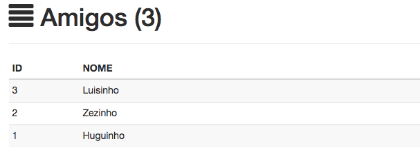
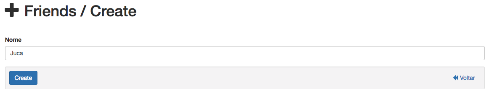
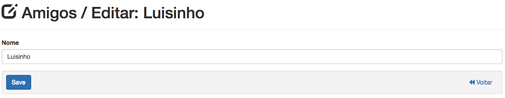

Controle de amigos
==================

    No controle da lista de amigos, você podera ter o controle de todos seus amigos.

Adicionando amigos
^^^^^^^^^^^^^^^^^^^^^^^^

1. Para adicionar um novo amigo a sua lista de amigos clique em:

.. image:: /_static/img/002.png

2. Em seguida preencha todos os campos do formulario:

3. E finalmente clique em:

.. image:: /_static/img/004.png

Editando amigos
^^^^^^^^^^^^^^^^^^^^^

1. Para editar o nome do seu amigo clique em:

.. image:: /_static/img/005.png

2. Em seguida atualize o valor do campo que deseja alterar no formulario:

3. E finalmente clique no botão a seguir para salvar:

.. image:: /_static/img/007.png

Deletando amigos
^^^^^^^^^^^^^^^^^^^^^^

1. Para deletar um amigo clique em:

.. image:: /_static/img/008.png

2. Em seguida confirme a ação clicando em "ok":

.. image:: /_static/img/009.png