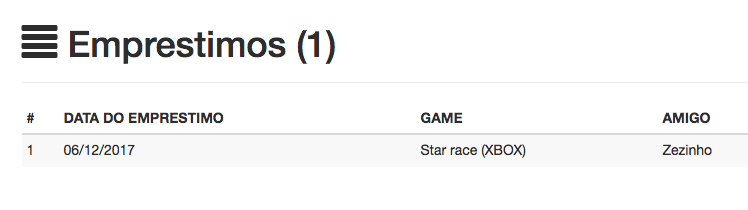
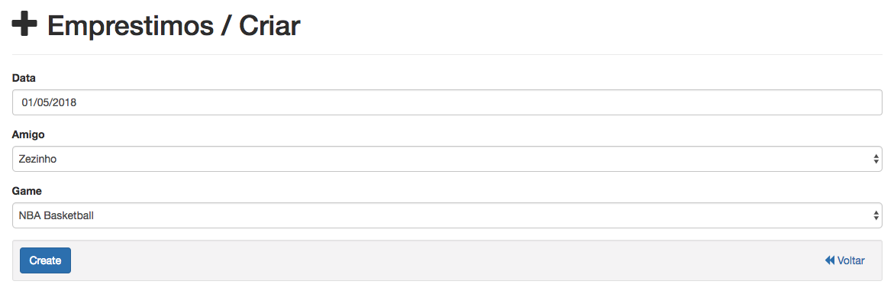
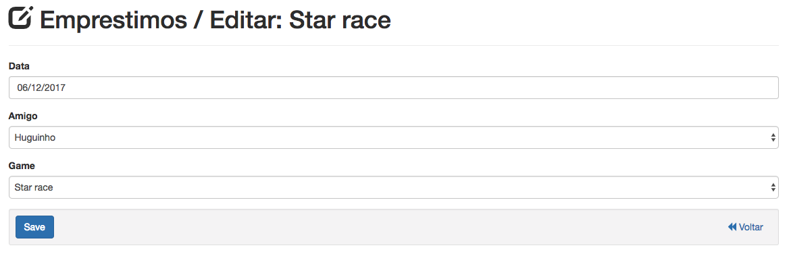

Controle de emprestimos
========================

    Em emprestimos você podera visualizar todos os emprestimos que foram realizados aos seus amigos. Saberá a quem e 
    quando foi emprestado um jogo da sua coleção de jogos.

Adicionando emprestimos
^^^^^^^^^^^^^^^^^^^^^^^^

1. Para adicionar um novo emprestimo clique em:

.. image:: /_static/img/002.png

2. Em seguida preencha todos os campos do formulario, selecionando a data, o amigo e o jogo a ser emprestado:

3. E finalmente clique em:

.. image:: /_static/img/004.png

Editando emprestimos
^^^^^^^^^^^^^^^^^^^^^

1. Para editar alguma informação de um emprestimo clique em:

.. image:: /_static/img/005.png

2. Em seguida atualize o valor do campo que deseja alterar no formulario:

3. E finalmente clique no botão a seguir para salvar:

.. image:: /_static/img/007.png

Deletando emprestimos
^^^^^^^^^^^^^^^^^^^^^^

1. Para deletar um emprestimo clique em:

.. image:: /_static/img/008.png

2. Em seguida confirme a ação clicando em "ok":

.. image:: /_static/img/009.png