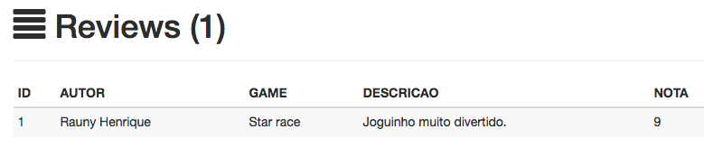
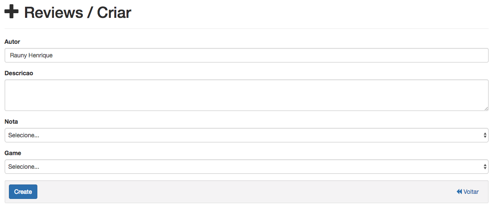
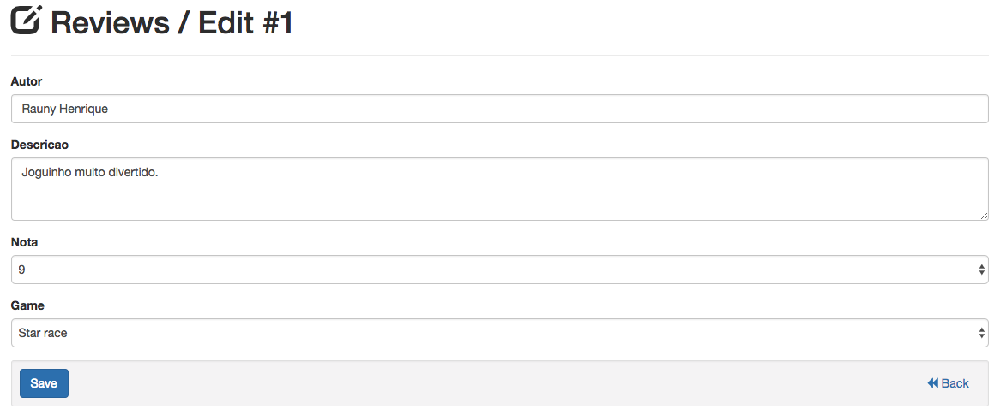

Controle de reviews
====================

    No controle de jogos, você podera adicionar, atualizar e deletelar jogos da sua coleção. Álem de obter uma visão de quanto tem gasto com
    seus jogos e o status geral de todos os jogos da sua coleção (jogando, pendente ou zerado).

Adicionando reviews
^^^^^^^^^^^^^^^^^^^^^^^^

1. Para adicionar um novo review clique em:

.. image:: /_static/img/002.png

2. Em seguida preencha todos os campos do formulario, informando o autor, o texto da review, a nota e o jogo:

3. E finalmente clique em:

.. image:: /_static/img/004.png

Editando reviews
^^^^^^^^^^^^^^^^^^^^^

1. Para editar alguma informação de um review clique em:

.. image:: /_static/img/005.png

2. Em seguida atualize o valor do campo que deseja alterar no formulario:

3. E finalmente clique no botão a seguir para salvar:

.. image:: /_static/img/007.png

Deletando reviews
^^^^^^^^^^^^^^^^^^^^^^

1. Para deletar um review clique em:

.. image:: /_static/img/008.png

2. Em seguida confirme a ação clicando em "ok":

.. image:: /_static/img/009.png